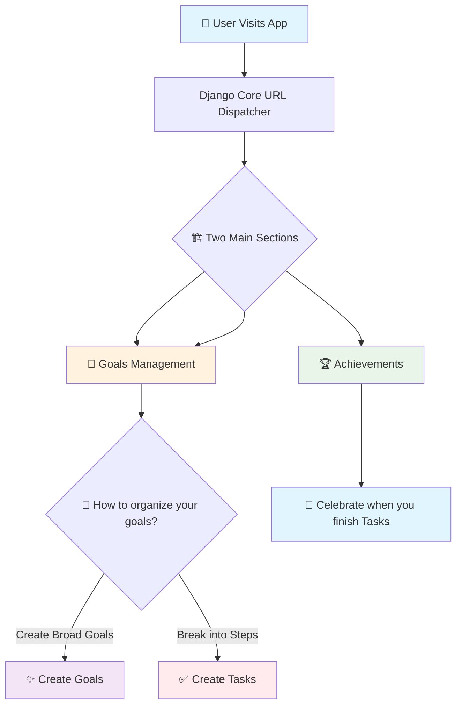

# miniTodoApp
Django (python)
the structure of the project 

in Futer I am gonna create this structure ::
goals_achievements_app/
├── goals/                 # Main goals management app
│   ├── models.py         # Goal and Task models
│   ├── views.py          # Views for goals and tasks
│   ├── urls.py           # URL routing for goals
│   └── templates/        # HTML templates
├── achievements/         # Achievements tracking app  
│   ├── models.py         # Achievement models
│   ├── views.py          # Achievement views
│   └── urls.py           # URL routing for achievements
├── static/              # CSS, JavaScript, images
├── templates/           # Base templates
└── manage.py           # Django management script