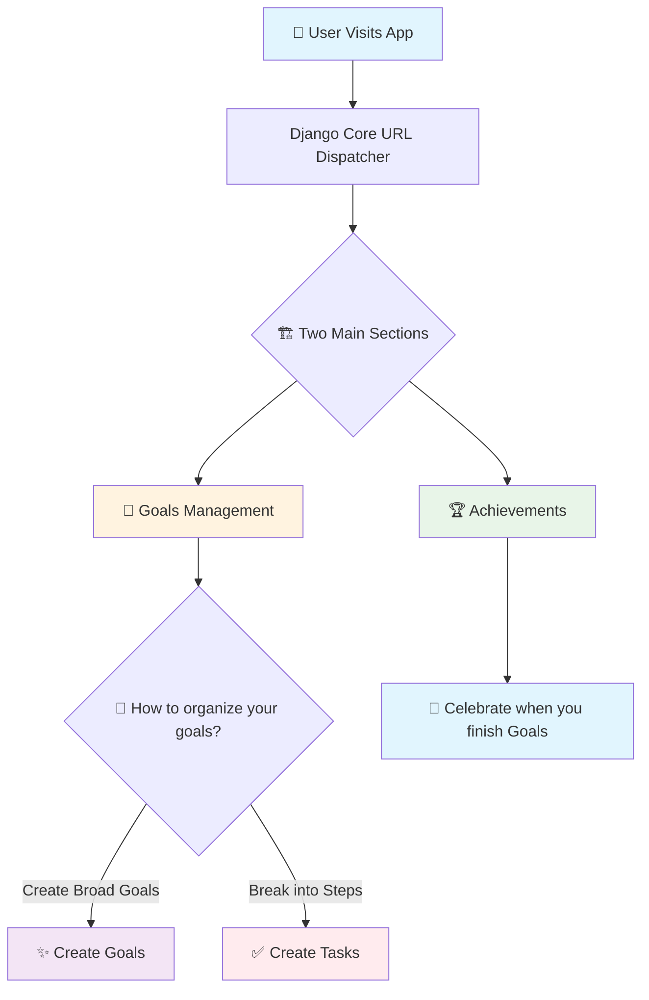

# miniTodoApp
Django (python)
the structure of the project 

```mermaid
graph TD
    A[🚀 User Visits App] --> B[Django Core URL Dispatcher];
    B --> C{🏗️ Two Main Sections};
    C --> D[🎯 Goals Management];
    C --> E[🏆 Achievements];
    D --> F{📝 How to organize your goals?};
    F -- Create Broad Goals --> G[✨ Create Goals];
    F -- Break into Steps --> H[✅ Create Tasks];
    E --> I[🎉 Celebrate when you finish Goals];

    style A fill:#e1f5fe
    style D fill:#fff3e0
    style E fill:#e8f5e8
    style G fill:#f3e5f5
    style H fill:#ffebee
    style I fill:#e1f5fe
```

