# miniTodoApp
Django (python)
the structure of the project 

```mermaid
graph TD
    A[🚀 User Visits App] --> B[Django Core URL Dispatcher];
    B --> C{🏗️ Two Main Sections};
    C --> D[🎯 Goals Management];
    C --> E[🏆 Achievements];
    D --> F{📝 How to organize your goals?};
    F -- Create Broad Goals --> G[✨ Create Goals];
    F -- Break into Steps --> H[✅ Create Tasks];
    E --> I[🎉 Celebrate when you finish Tasks];
    C-->D;

    style A fill:#e1f5fe
    style D fill:#fff3e0
    style E fill:#e8f5e8
    style G fill:#f3e5f5
    style H fill:#ffebee
    style I fill:#e1f5fe
```

in Futer I am gonna create this structure ::
goals_achievements_app/
├── goals/                 # Main goals management app
│   ├── models.py         # Goal and Task models
│   ├── views.py          # Views for goals and tasks
│   ├── urls.py           # URL routing for goals
│   └── templates/        # HTML templates
├── achievements/         # Achievements tracking app  
│   ├── models.py         # Achievement models
│   ├── views.py          # Achievement views
│   └── urls.py           # URL routing for achievements
├── static/              # CSS, JavaScript, images
├── templates/           # Base templates
└── manage.py           # Django management script